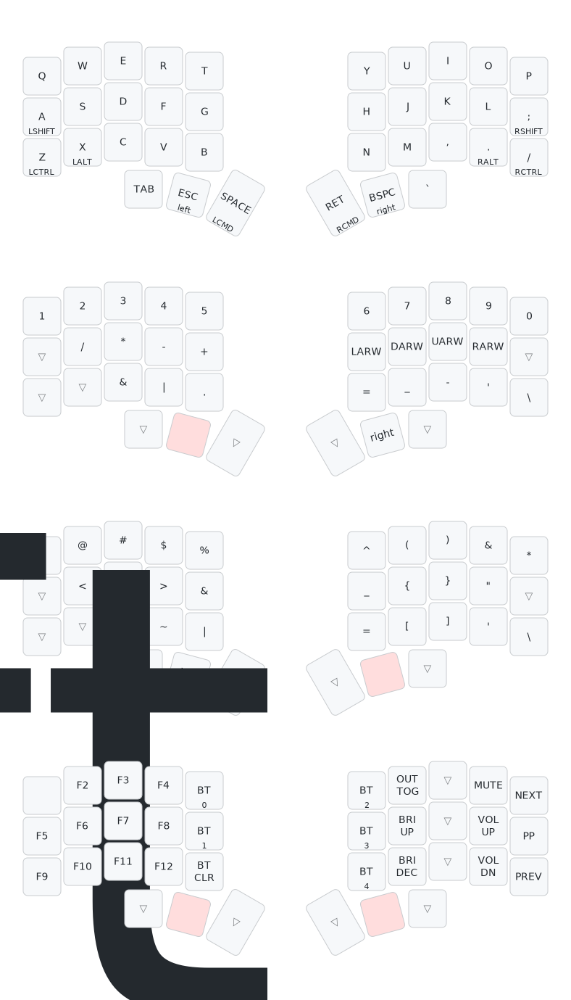

# kyoka-suigetsu-zmk-config 

鏡花水月 「Kyōka Suigetsu」(Mirror Flower, Water Moon). Personal [ZMK](https://zmk.dev/) config for my wireless [chocofi](https://github.com/pashutk/chocofi) 5x3+3 split keyboard powered by nice!nanos v2.

## Keymap: Mikazuki Nitoryu (Crescent moon dual-wield)

The keymap is a ZMK port of my QMK keymap: [mikazuki-chocofi-qmk-c](https://github.com/takiguri/mikazuki-chocofi-qmk-c)

Illustrations powered by [keymap-drawer](https://caksoylar.github.io/keymap-drawer?keymap_yaml=H4sIAAAAAAAC_71UWXLTQBD9zymGLYLgLLbsLGYptCYGORZaTMKmCCxhVxQryJMqXMYcg9twGU6C1N2yrDJgEwr08V7Pm57u1vTMRP44vuJNNvl4ce6dB-N3sZ_0mux9nAwDL4m5z4NehUXg5Q39i6DJDOm04zre6DIacE_81PDE6VrqECSj5hpjvSD0ryKemZvsOeALQA3QAnQATwFdwBZgB9AEnKRVSRXWTxPaRy3dmYJqA6qAOuAh4BHgU8BngMYsygOIYs1FydSXGFtxLKMQT1CUDHJUALuAMuAxYBtQqAizlVuYZLYy07ZRK1I4kjyb1GwFpqMg5MUS25QUjSprq4VuaQ4Fm1dl28QgyeBDn6IIZ1lRWVTsgVDFIoUasUhcJ24Q7xLvEe8THxDvFD_7_eu3CuPjy_Q08MQfjjDzNvptkP8m8n3shmThMVBzw80NKzd-Hfk6M8I61fEZeQtHj3DklWoU0g-M10vTgdIPot71K4Nm_dYHPKh9N6jEJ8S3kG_j6A6O3gLeBbxX_v2NZW17WN6Kx0JpPW3UhNQp8U3hX7QsPzpfyq3Lmya8In7zh23LbsNf1Ltiz3kyoJ6tj-KQe3EYYnl6DUlEqhf3Fy91erWmC1qNtPStZU7ncEmRbdfBB_ZYO8HXVW8g7SLtIe0v5Kn-JLdImmy1mGsuSd3tGLmTiaQfIFV3iKvEuA-ywxTDWkhan0uqasoKWVV8jE1L6_6Pe7tikB-X-SEjUwcAAA%3D%3D)

### Layout

